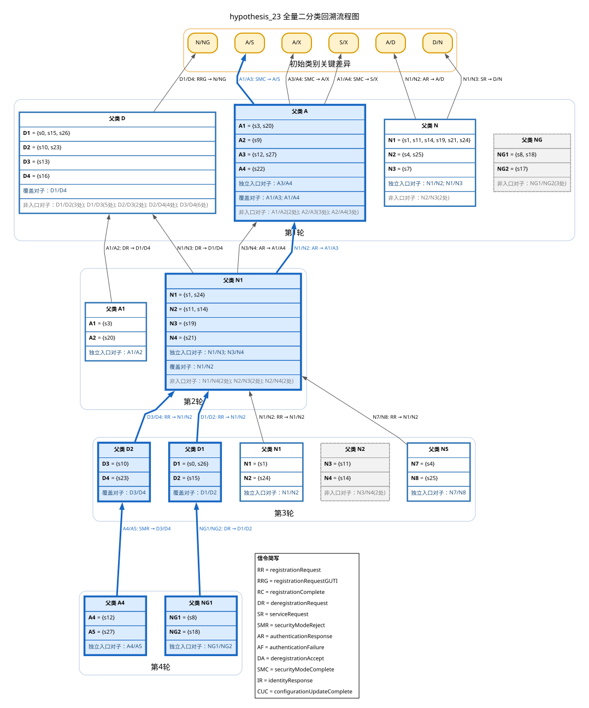

# hypothesis_23 全量二分类回溯检验报告

## 1. 数据来源与判定规则

- 原始 DOT：`D:\state-learning-lab\projects\state-learning-experiments\experiments\open5gs\baseline-mdf-servreq\2026-07-17\evidence\hypotheses\hypothesis_23.dot`
- SHA-256：`e0ff218edf17bcbc8af9cf5a4a07d530c3ed62ad0ffab45e150e9d475109d6e2`
- 入口策略：`strict`；默认入口必须恰有一个 signature 差异位置。
- 节点按 `(轮次, 父类, 无序子类对)` 去重；从最后有效轮向第1轮扫描。
- 多位置对子不独立启动；仅在回溯需要时作为中间节点，同一上游对子合并信令，不同上游对子分别分支。

| 位置 | 输入 | 简写 |
|---:|---|---|
| 1 | `registrationRequest` | `RR` |
| 2 | `registrationRequestGUTI` | `RRG` |
| 3 | `registrationComplete` | `RC` |
| 4 | `deregistrationRequest` | `DR` |
| 5 | `serviceRequest` | `SR` |
| 6 | `securityModeReject` | `SMR` |
| 7 | `authenticationResponse` | `AR` |
| 8 | `authenticationFailure` | `AF` |
| 9 | `deregistrationAccept` | `DA` |
| 10 | `securityModeComplete` | `SMC` |
| 11 | `identityResponse` | `IR` |
| 12 | `configurationUpdateComplete` | `CUC` |

## 2. 重算统计

| 轮次 | 拆分父类 | 候选对子 | 严格入口对子 | 非严格对子 |
|---:|---:|---:|---:|---:|
| 4 | 2 | 2 | 2 | 0 |
| 3 | 5 | 5 | 4 | 1 |
| 2 | 2 | 7 | 4 | 3 |
| 1 | 4 | 16 | 6 | 10 |
| 合计 | — | 30 | 16 | 14 |

- 状态数：28；拆分父类数：`[4, 2, 5, 2, 0]`。
- 独立入口：10；回溯节点：16；已覆盖节点：6。
- 轮间关系：10；终点关系：6；初始关键差异：6。

## 3. 独立入口与去重路径

| 序号 | 入口 | 轮次与父类 | 子类对 | 去重路径 |
|---:|---|---|---|---|
| 1 | `B01` | 第4轮 `A4` | `A4/A5` | B01 --SMR→ B04；B04 --RR→ B08；B08 --AR→ B11；B11 --SMC→ K2 |
| 2 | `B02` | 第4轮 `NG1` | `NG1/NG2` | B02 --DR→ B03；B03 --RR→ B08；B08 --AR→ B11；B11 --SMC→ K2 |
| 3 | `B05` | 第3轮 `N1` | `N1/N2` | B05 --RR→ B08；B08 --AR→ B11；B11 --SMC→ K2 |
| 4 | `B06` | 第3轮 `N5` | `N7/N8` | B06 --RR→ B08；B08 --AR→ B11；B11 --SMC→ K2 |
| 5 | `B07` | 第2轮 `A1` | `A1/A2` | B07 --DR→ B14；B14 --RRG→ K5 |
| 6 | `B09` | 第2轮 `N1` | `N1/N3` | B09 --DR→ B14；B14 --RRG→ K5 |
| 7 | `B10` | 第2轮 `N1` | `N3/N4` | B10 --AR→ B12；B12 --SMC→ K6 |
| 8 | `B13` | 第1轮 `A` | `A3/A4` | B13 --SMC→ K3 |
| 9 | `B15` | 第1轮 `N` | `N1/N2` | B15 --AR→ K1 |
| 10 | `B16` | 第1轮 `N` | `N1/N3` | B16 --SR→ K4 |

### 固定 A/B 具体状态轨迹

#### `B01`

- 路径 1 / 输入变体 1：`securityModeReject registrationRequest authenticationResponse securityModeComplete` → `stage0:A/S`
  - branch A（入口子类 `A4`，起点 `s12`）：`s12 → s10 → s11 → s12 → s12`
  - branch B（入口子类 `A5`，起点 `s27`）：`s27 → s23 → s24 → s3 → s5`

#### `B02`

- 路径 1 / 输入变体 1：`deregistrationRequest registrationRequest authenticationResponse securityModeComplete` → `stage0:A/S`
  - branch A（入口子类 `NG1`，起点 `s8`）：`s8 → s0 → s1 → s3 → s5`
  - branch B（入口子类 `NG2`，起点 `s18`）：`s18 → s15 → s14 → s27 → s27`

#### `B05`

- 路径 1 / 输入变体 1：`registrationRequest authenticationResponse securityModeComplete` → `stage0:A/S`
  - branch A（入口子类 `N1`，起点 `s1`）：`s1 → s1 → s3 → s5`
  - branch B（入口子类 `N2`，起点 `s24`）：`s24 → s11 → s12 → s12`

#### `B06`

- 路径 1 / 输入变体 1：`registrationRequest authenticationResponse securityModeComplete` → `stage0:A/S`
  - branch A（入口子类 `N7`，起点 `s4`）：`s4 → s1 → s3 → s5`
  - branch B（入口子类 `N8`，起点 `s25`）：`s25 → s11 → s12 → s12`

#### `B07`

- 路径 1 / 输入变体 1：`deregistrationRequest registrationRequestGUTI` → `stage0:N/NG`
  - branch A（入口子类 `A1`，起点 `s3`）：`s3 → s0 → s8`
  - branch B（入口子类 `A2`，起点 `s20`）：`s20 → s16 → s19`

#### `B09`

- 路径 1 / 输入变体 1：`deregistrationRequest registrationRequestGUTI` → `stage0:N/NG`
  - branch A（入口子类 `N1`，起点 `s1`）：`s1 → s0 → s8`
  - branch A（入口子类 `N1`，起点 `s24`）：`s24 → s0 → s8`
  - branch B（入口子类 `N3`，起点 `s19`）：`s19 → s16 → s19`

#### `B10`

- 路径 1 / 输入变体 1：`authenticationResponse securityModeComplete` → `stage0:S/X`
  - branch A（入口子类 `N3`，起点 `s19`）：`s19 → s20 → s5`
  - branch B（入口子类 `N4`，起点 `s21`）：`s21 → s22 → s2`

#### `B13`

- 路径 1 / 输入变体 1：`securityModeComplete` → `stage0:A/X`
  - branch A（入口子类 `A3`，起点 `s12`）：`s12 → s12`
  - branch A（入口子类 `A3`，起点 `s27`）：`s27 → s27`
  - branch B（入口子类 `A4`，起点 `s22`）：`s22 → s2`

#### `B15`

- 路径 1 / 输入变体 1：`authenticationResponse` → `stage0:A/D`
  - branch A（入口子类 `N1`，起点 `s1`）：`s1 → s3`
  - branch A（入口子类 `N1`，起点 `s11`）：`s11 → s12`
  - branch A（入口子类 `N1`，起点 `s14`）：`s14 → s27`
  - branch A（入口子类 `N1`，起点 `s19`）：`s19 → s20`
  - branch A（入口子类 `N1`，起点 `s21`）：`s21 → s22`
  - branch A（入口子类 `N1`，起点 `s24`）：`s24 → s3`
  - branch B（入口子类 `N2`，起点 `s4`）：`s4 → s0`
  - branch B（入口子类 `N2`，起点 `s25`）：`s25 → s0`

#### `B16`

- 路径 1 / 输入变体 1：`serviceRequest` → `stage0:D/N`
  - branch A（入口子类 `N1`，起点 `s1`）：`s1 → s1`
  - branch A（入口子类 `N1`，起点 `s11`）：`s11 → s11`
  - branch A（入口子类 `N1`，起点 `s14`）：`s14 → s14`
  - branch A（入口子类 `N1`，起点 `s19`）：`s19 → s19`
  - branch A（入口子类 `N1`，起点 `s21`）：`s21 → s21`
  - branch A（入口子类 `N1`，起点 `s24`）：`s24 → s24`
  - branch B（入口子类 `N3`，起点 `s7`）：`s7 → s0`

## 4. 去重后的回溯节点：完整 signature、代表转移与全部成员转移变体

### 第 4 轮

#### `B01`：父类 `A4` 的 `A4/A5`（独立入口）

- 子类 `A4` = {s12}
  - signature：`(N4, N4, A4, D2, A4, D3, A4, A4, A4, A4, A4, A4)`
- 子类 `A5` = {s27}
  - signature：`(N4, N4, A4, D2, A4, D4, A4, A4, A4, A4, A4, A4)`

| 位置 | 输入 | 简写 | 上游类别对 | `A4` 代表转移 | `A5` 代表转移 |
|---:|---|---|---|---|---|
| 6 | `securityModeReject` | `SMR` | `D3/D4` | `s12 --securityModeReject / null_action→ s10` | `s27 --securityModeReject / null_action→ s23` |
|  | 全部成员转移变体 |  |  | `s12 --securityModeReject / null_action→ s10` | `s27 --securityModeReject / null_action→ s23` |

- 回溯关系：`B01 --SMR→ B04`。
- 全部成员状态交叉对在模型内行为等价：`False`。
  - `s12/s27`：最短区分序列 `securityModeReject registrationRequest authenticationResponse securityModeComplete` → `s12:null_action/s3:registrationAccept`。

#### `B02`：父类 `NG1` 的 `NG1/NG2`（独立入口）

- 子类 `NG1` = {s8}
  - signature：`(N1, NG1, NG1, D1, NG1, NG1, NG1, NG1, NG1, NG1, N1, NG1)`
- 子类 `NG2` = {s18}
  - signature：`(N1, NG1, NG1, D2, NG1, NG1, NG1, NG1, NG1, NG1, N1, NG1)`

| 位置 | 输入 | 简写 | 上游类别对 | `NG1` 代表转移 | `NG2` 代表转移 |
|---:|---|---|---|---|---|
| 4 | `deregistrationRequest` | `DR` | `D1/D2` | `s8 --deregistrationRequest / null_action→ s0` | `s18 --deregistrationRequest / null_action→ s15` |
|  | 全部成员转移变体 |  |  | `s8 --deregistrationRequest / null_action→ s0` | `s18 --deregistrationRequest / null_action→ s15` |

- 回溯关系：`B02 --DR→ B03`。
- 全部成员状态交叉对在模型内行为等价：`False`。
  - `s8/s18`：最短区分序列 `deregistrationRequest registrationRequest authenticationResponse securityModeComplete` → `s3:registrationAccept/s27:null_action`。

### 第 3 轮

#### `B03`：父类 `D1` 的 `D1/D2`（已由较晚路径覆盖）

- 子类 `D1` = {s0, s26}
  - signature：`(N1, NG1, D1, D1, D1, X, X, X, X, D1, N5, D1)`
- 子类 `D2` = {s15}
  - signature：`(N2, NG1, D1, D1, D1, X, X, X, X, D1, N5, D1)`

| 位置 | 输入 | 简写 | 上游类别对 | `D1` 代表转移 | `D2` 代表转移 |
|---:|---|---|---|---|---|
| 1 | `registrationRequest` | `RR` | `N1/N2` | `s0 --registrationRequest / authenticationRequest→ s1` | `s15 --registrationRequest / authenticationRequest→ s14` |
|  | 全部成员转移变体 |  |  | `s0 --registrationRequest / authenticationRequest→ s1；s26 --registrationRequest / authenticationRequest→ s1` | `s15 --registrationRequest / authenticationRequest→ s14` |

- 回溯关系：`B03 --RR→ B08`。
- 全部成员状态交叉对在模型内行为等价：`False`。
  - `s0/s15`：最短区分序列 `registrationRequest authenticationResponse securityModeComplete` → `s3:registrationAccept/s27:null_action`。
  - `s26/s15`：最短区分序列 `registrationRequestGUTI` → `s26:null_action/s15:identityRequest`。

#### `B04`：父类 `D2` 的 `D3/D4`（已由较晚路径覆盖）

- 子类 `D3` = {s10}
  - signature：`(N2, NG1, X, D1, D2, X, X, X, X, X, N5, X)`
- 子类 `D4` = {s23}
  - signature：`(N1, NG1, X, D1, D2, X, X, X, X, X, N5, X)`

| 位置 | 输入 | 简写 | 上游类别对 | `D3` 代表转移 | `D4` 代表转移 |
|---:|---|---|---|---|---|
| 1 | `registrationRequest` | `RR` | `N1/N2` | `s10 --registrationRequest / authenticationRequest→ s11` | `s23 --registrationRequest / authenticationRequest→ s24` |
|  | 全部成员转移变体 |  |  | `s10 --registrationRequest / authenticationRequest→ s11` | `s23 --registrationRequest / authenticationRequest→ s24` |

- 回溯关系：`B04 --RR→ B08`。
- 全部成员状态交叉对在模型内行为等价：`False`。
  - `s10/s23`：最短区分序列 `registrationRequest authenticationResponse securityModeComplete` → `s12:null_action/s3:registrationAccept`。

#### `B05`：父类 `N1` 的 `N1/N2`（独立入口）

- 子类 `N1` = {s1}
  - signature：`(N1, N1, N1, D1, N1, N1, A1, D1, N1, N1, N1, N1)`
- 子类 `N2` = {s24}
  - signature：`(N2, N1, N1, D1, N1, N1, A1, D1, N1, N1, N1, N1)`

| 位置 | 输入 | 简写 | 上游类别对 | `N1` 代表转移 | `N2` 代表转移 |
|---:|---|---|---|---|---|
| 1 | `registrationRequest` | `RR` | `N1/N2` | `s1 --registrationRequest / authenticationRequest→ s1` | `s24 --registrationRequest / authenticationRequest→ s11` |
|  | 全部成员转移变体 |  |  | `s1 --registrationRequest / authenticationRequest→ s1` | `s24 --registrationRequest / authenticationRequest→ s11` |

- 回溯关系：`B05 --RR→ B08`。
- 全部成员状态交叉对在模型内行为等价：`False`。
  - `s1/s24`：最短区分序列 `registrationRequest authenticationResponse securityModeComplete` → `s3:registrationAccept/s12:null_action`。

#### `B06`：父类 `N5` 的 `N7/N8`（独立入口）

- 子类 `N7` = {s4}
  - signature：`(N1, N1, N5, D1, N5, N5, D1, D1, N5, N5, N5, N5)`
- 子类 `N8` = {s25}
  - signature：`(N2, N1, N5, D1, N5, N5, D1, D1, N5, N5, N5, N5)`

| 位置 | 输入 | 简写 | 上游类别对 | `N7` 代表转移 | `N8` 代表转移 |
|---:|---|---|---|---|---|
| 1 | `registrationRequest` | `RR` | `N1/N2` | `s4 --registrationRequest / authenticationRequest→ s1` | `s25 --registrationRequest / authenticationRequest→ s11` |
|  | 全部成员转移变体 |  |  | `s4 --registrationRequest / authenticationRequest→ s1` | `s25 --registrationRequest / authenticationRequest→ s11` |

- 回溯关系：`B06 --RR→ B08`。
- 全部成员状态交叉对在模型内行为等价：`False`。
  - `s4/s25`：最短区分序列 `registrationRequest authenticationResponse securityModeComplete` → `s3:registrationAccept/s12:null_action`。

### 第 2 轮

#### `B07`：父类 `A1` 的 `A1/A2`（独立入口）

- 子类 `A1` = {s3}
  - signature：`(N1, N1, A1, D1, A1, D2, A1, A1, A1, S1, A1, A1)`
- 子类 `A2` = {s20}
  - signature：`(N1, N1, A1, D4, A1, D2, A1, A1, A1, S1, A1, A1)`

| 位置 | 输入 | 简写 | 上游类别对 | `A1` 代表转移 | `A2` 代表转移 |
|---:|---|---|---|---|---|
| 4 | `deregistrationRequest` | `DR` | `D1/D4` | `s3 --deregistrationRequest / null_action→ s0` | `s20 --deregistrationRequest / null_action→ s16` |
|  | 全部成员转移变体 |  |  | `s3 --deregistrationRequest / null_action→ s0` | `s20 --deregistrationRequest / null_action→ s16` |

- 回溯关系：`B07 --DR→ B14`。
- 全部成员状态交叉对在模型内行为等价：`False`。
  - `s3/s20`：最短区分序列 `deregistrationRequest registrationRequestGUTI` → `s0:identityRequest/s16:authenticationRequest`。

#### `B08`：父类 `N1` 的 `N1/N2`（已由较晚路径覆盖）

- 子类 `N1` = {s1, s24}
  - signature：`(N1, N1, N1, D1, N1, N1, A1, D1, N1, N1, N1, N1)`
- 子类 `N2` = {s11, s14}
  - signature：`(N1, N1, N1, D1, N1, N1, A3, D1, N1, N1, N1, N1)`

| 位置 | 输入 | 简写 | 上游类别对 | `N1` 代表转移 | `N2` 代表转移 |
|---:|---|---|---|---|---|
| 7 | `authenticationResponse` | `AR` | `A1/A3` | `s1 --authenticationResponse / securityModeCommand→ s3` | `s11 --authenticationResponse / securityModeCommand→ s12` |
|  | 全部成员转移变体 |  |  | `s1 --authenticationResponse / securityModeCommand→ s3；s24 --authenticationResponse / securityModeCommand→ s3` | `s11 --authenticationResponse / securityModeCommand→ s12；s14 --authenticationResponse / securityModeCommand→ s27` |

- 回溯关系：`B08 --AR→ B11`。
- 全部成员状态交叉对在模型内行为等价：`False`。
  - `s1/s11`：最短区分序列 `authenticationResponse securityModeComplete` → `s3:registrationAccept/s12:null_action`。
  - `s1/s14`：最短区分序列 `authenticationResponse securityModeComplete` → `s3:registrationAccept/s27:null_action`。
  - `s24/s11`：最短区分序列 `authenticationResponse securityModeComplete` → `s3:registrationAccept/s12:null_action`。
  - `s24/s14`：最短区分序列 `authenticationResponse securityModeComplete` → `s3:registrationAccept/s27:null_action`。

#### `B09`：父类 `N1` 的 `N1/N3`（独立入口）

- 子类 `N1` = {s1, s24}
  - signature：`(N1, N1, N1, D1, N1, N1, A1, D1, N1, N1, N1, N1)`
- 子类 `N3` = {s19}
  - signature：`(N1, N1, N1, D4, N1, N1, A1, D1, N1, N1, N1, N1)`

| 位置 | 输入 | 简写 | 上游类别对 | `N1` 代表转移 | `N3` 代表转移 |
|---:|---|---|---|---|---|
| 4 | `deregistrationRequest` | `DR` | `D1/D4` | `s1 --deregistrationRequest / null_action→ s0` | `s19 --deregistrationRequest / null_action→ s16` |
|  | 全部成员转移变体 |  |  | `s1 --deregistrationRequest / null_action→ s0；s24 --deregistrationRequest / null_action→ s0` | `s19 --deregistrationRequest / null_action→ s16` |

- 回溯关系：`B09 --DR→ B14`。
- 全部成员状态交叉对在模型内行为等价：`False`。
  - `s1/s19`：最短区分序列 `deregistrationRequest registrationRequestGUTI` → `s0:identityRequest/s16:authenticationRequest`。
  - `s24/s19`：最短区分序列 `deregistrationRequest registrationRequestGUTI` → `s0:identityRequest/s16:authenticationRequest`。

#### `B10`：父类 `N1` 的 `N3/N4`（独立入口）

- 子类 `N3` = {s19}
  - signature：`(N1, N1, N1, D4, N1, N1, A1, D1, N1, N1, N1, N1)`
- 子类 `N4` = {s21}
  - signature：`(N1, N1, N1, D4, N1, N1, A4, D1, N1, N1, N1, N1)`

| 位置 | 输入 | 简写 | 上游类别对 | `N3` 代表转移 | `N4` 代表转移 |
|---:|---|---|---|---|---|
| 7 | `authenticationResponse` | `AR` | `A1/A4` | `s19 --authenticationResponse / securityModeCommand→ s20` | `s21 --authenticationResponse / securityModeCommand→ s22` |
|  | 全部成员转移变体 |  |  | `s19 --authenticationResponse / securityModeCommand→ s20` | `s21 --authenticationResponse / securityModeCommand→ s22` |

- 回溯关系：`B10 --AR→ B12`。
- 全部成员状态交叉对在模型内行为等价：`False`。
  - `s19/s21`：最短区分序列 `authenticationResponse securityModeComplete` → `s20:registrationAccept/s22:null_action`。

### 第 1 轮

#### `B11`：父类 `A` 的 `A1/A3`（已由较晚路径覆盖）

- 子类 `A1` = {s3, s20}
  - signature：`(N, N, A, D, A, D, A, A, A, S, A, A)`
- 子类 `A3` = {s12, s27}
  - signature：`(N, N, A, D, A, D, A, A, A, A, A, A)`

| 位置 | 输入 | 简写 | 上游类别对 | `A1` 代表转移 | `A3` 代表转移 |
|---:|---|---|---|---|---|
| 10 | `securityModeComplete` | `SMC` | `A/S` | `s3 --securityModeComplete / registrationAccept→ s5` | `s12 --securityModeComplete / null_action→ s12` |
|  | 全部成员转移变体 |  |  | `s3 --securityModeComplete / registrationAccept→ s5；s20 --securityModeComplete / registrationAccept→ s5` | `s12 --securityModeComplete / null_action→ s12；s27 --securityModeComplete / null_action→ s27` |

- 回溯关系：`B11 --SMC→ K2`。
- 全部成员状态交叉对在模型内行为等价：`False`。
  - `s3/s12`：最短区分序列 `securityModeComplete` → `s3:registrationAccept/s12:null_action`。
  - `s3/s27`：最短区分序列 `securityModeComplete` → `s3:registrationAccept/s27:null_action`。
  - `s20/s12`：最短区分序列 `securityModeComplete` → `s20:registrationAccept/s12:null_action`。
  - `s20/s27`：最短区分序列 `securityModeComplete` → `s20:registrationAccept/s27:null_action`。

#### `B12`：父类 `A` 的 `A1/A4`（已由较晚路径覆盖）

- 子类 `A1` = {s3, s20}
  - signature：`(N, N, A, D, A, D, A, A, A, S, A, A)`
- 子类 `A4` = {s22}
  - signature：`(N, N, A, D, A, D, A, A, A, X, A, A)`

| 位置 | 输入 | 简写 | 上游类别对 | `A1` 代表转移 | `A4` 代表转移 |
|---:|---|---|---|---|---|
| 10 | `securityModeComplete` | `SMC` | `S/X` | `s3 --securityModeComplete / registrationAccept→ s5` | `s22 --securityModeComplete / null_action→ s2` |
|  | 全部成员转移变体 |  |  | `s3 --securityModeComplete / registrationAccept→ s5；s20 --securityModeComplete / registrationAccept→ s5` | `s22 --securityModeComplete / null_action→ s2` |

- 回溯关系：`B12 --SMC→ K6`。
- 全部成员状态交叉对在模型内行为等价：`False`。
  - `s3/s22`：最短区分序列 `securityModeComplete` → `s3:registrationAccept/s22:null_action`。
  - `s20/s22`：最短区分序列 `securityModeComplete` → `s20:registrationAccept/s22:null_action`。

#### `B13`：父类 `A` 的 `A3/A4`（独立入口）

- 子类 `A3` = {s12, s27}
  - signature：`(N, N, A, D, A, D, A, A, A, A, A, A)`
- 子类 `A4` = {s22}
  - signature：`(N, N, A, D, A, D, A, A, A, X, A, A)`

| 位置 | 输入 | 简写 | 上游类别对 | `A3` 代表转移 | `A4` 代表转移 |
|---:|---|---|---|---|---|
| 10 | `securityModeComplete` | `SMC` | `A/X` | `s12 --securityModeComplete / null_action→ s12` | `s22 --securityModeComplete / null_action→ s2` |
|  | 全部成员转移变体 |  |  | `s12 --securityModeComplete / null_action→ s12；s27 --securityModeComplete / null_action→ s27` | `s22 --securityModeComplete / null_action→ s2` |

- 回溯关系：`B13 --SMC→ K3`。
- 全部成员状态交叉对在模型内行为等价：`False`。
  - `s12/s22`：最短区分序列 `deregistrationRequest registrationRequestGUTI` → `s15:identityRequest/s16:authenticationRequest`。
  - `s27/s22`：最短区分序列 `deregistrationRequest registrationRequestGUTI` → `s15:identityRequest/s16:authenticationRequest`。

#### `B14`：父类 `D` 的 `D1/D4`（已由较晚路径覆盖）

- 子类 `D1` = {s0, s15, s26}
  - signature：`(N, NG, D, D, D, X, X, X, X, D, N, D)`
- 子类 `D4` = {s16}
  - signature：`(N, N, D, D, D, X, X, X, X, D, N, D)`

| 位置 | 输入 | 简写 | 上游类别对 | `D1` 代表转移 | `D4` 代表转移 |
|---:|---|---|---|---|---|
| 2 | `registrationRequestGUTI` | `RRG` | `N/NG` | `s0 --registrationRequestGUTI / identityRequest→ s8` | `s16 --registrationRequestGUTI / authenticationRequest→ s19` |
|  | 全部成员转移变体 |  |  | `s0 --registrationRequestGUTI / identityRequest→ s8；s15 --registrationRequestGUTI / identityRequest→ s18；s26 --registrationRequestGUTI / null_action→ s8` | `s16 --registrationRequestGUTI / authenticationRequest→ s19` |

- 回溯关系：`B14 --RRG→ K5`。
- 全部成员状态交叉对在模型内行为等价：`False`。
  - `s0/s16`：最短区分序列 `registrationRequestGUTI` → `s0:identityRequest/s16:authenticationRequest`。
  - `s15/s16`：最短区分序列 `registrationRequestGUTI` → `s15:identityRequest/s16:authenticationRequest`。
  - `s26/s16`：最短区分序列 `registrationRequestGUTI` → `s26:null_action/s16:authenticationRequest`。

#### `B15`：父类 `N` 的 `N1/N2`（独立入口）

- 子类 `N1` = {s1, s11, s14, s19, s21, s24}
  - signature：`(N, N, N, D, N, N, A, D, N, N, N, N)`
- 子类 `N2` = {s4, s25}
  - signature：`(N, N, N, D, N, N, D, D, N, N, N, N)`

| 位置 | 输入 | 简写 | 上游类别对 | `N1` 代表转移 | `N2` 代表转移 |
|---:|---|---|---|---|---|
| 7 | `authenticationResponse` | `AR` | `A/D` | `s1 --authenticationResponse / securityModeCommand→ s3` | `s4 --authenticationResponse / authenticationReject→ s0` |
|  | 全部成员转移变体 |  |  | `s1 --authenticationResponse / securityModeCommand→ s3；s11 --authenticationResponse / securityModeCommand→ s12；s14 --authenticationResponse / securityModeCommand→ s27；s19 --authenticationResponse / securityModeCommand→ s20；s21 --authenticationResponse / securityModeCommand→ s22；s24 --authenticationResponse / securityModeCommand→ s3` | `s4 --authenticationResponse / authenticationReject→ s0；s25 --authenticationResponse / authenticationReject→ s0` |

- 回溯关系：`B15 --AR→ K1`。
- 全部成员状态交叉对在模型内行为等价：`False`。
  - `s1/s4`：最短区分序列 `authenticationResponse` → `s1:securityModeCommand/s4:authenticationReject`。
  - `s1/s25`：最短区分序列 `authenticationResponse` → `s1:securityModeCommand/s25:authenticationReject`。
  - `s11/s4`：最短区分序列 `authenticationResponse` → `s11:securityModeCommand/s4:authenticationReject`。
  - `s11/s25`：最短区分序列 `authenticationResponse` → `s11:securityModeCommand/s25:authenticationReject`。
  - `s14/s4`：最短区分序列 `authenticationResponse` → `s14:securityModeCommand/s4:authenticationReject`。
  - `s14/s25`：最短区分序列 `authenticationResponse` → `s14:securityModeCommand/s25:authenticationReject`。
  - `s19/s4`：最短区分序列 `authenticationResponse` → `s19:securityModeCommand/s4:authenticationReject`。
  - `s19/s25`：最短区分序列 `authenticationResponse` → `s19:securityModeCommand/s25:authenticationReject`。
  - `s21/s4`：最短区分序列 `authenticationResponse` → `s21:securityModeCommand/s4:authenticationReject`。
  - `s21/s25`：最短区分序列 `authenticationResponse` → `s21:securityModeCommand/s25:authenticationReject`。
  - `s24/s4`：最短区分序列 `authenticationResponse` → `s24:securityModeCommand/s4:authenticationReject`。
  - `s24/s25`：最短区分序列 `authenticationResponse` → `s24:securityModeCommand/s25:authenticationReject`。

#### `B16`：父类 `N` 的 `N1/N3`（独立入口）

- 子类 `N1` = {s1, s11, s14, s19, s21, s24}
  - signature：`(N, N, N, D, N, N, A, D, N, N, N, N)`
- 子类 `N3` = {s7}
  - signature：`(N, N, N, D, D, N, A, D, N, N, N, N)`

| 位置 | 输入 | 简写 | 上游类别对 | `N1` 代表转移 | `N3` 代表转移 |
|---:|---|---|---|---|---|
| 5 | `serviceRequest` | `SR` | `D/N` | `s1 --serviceRequest / null_action→ s1` | `s7 --serviceRequest / serviceReject→ s0` |
|  | 全部成员转移变体 |  |  | `s1 --serviceRequest / null_action→ s1；s11 --serviceRequest / null_action→ s11；s14 --serviceRequest / null_action→ s14；s19 --serviceRequest / null_action→ s19；s21 --serviceRequest / null_action→ s21；s24 --serviceRequest / null_action→ s24` | `s7 --serviceRequest / serviceReject→ s0` |

- 回溯关系：`B16 --SR→ K4`。
- 全部成员状态交叉对在模型内行为等价：`False`。
  - `s1/s7`：最短区分序列 `registrationRequest` → `s1:authenticationRequest/s7:null_action`。
  - `s11/s7`：最短区分序列 `registrationRequest` → `s11:authenticationRequest/s7:null_action`。
  - `s14/s7`：最短区分序列 `registrationRequest` → `s14:authenticationRequest/s7:null_action`。
  - `s19/s7`：最短区分序列 `registrationRequest` → `s19:authenticationRequest/s7:null_action`。
  - `s21/s7`：最短区分序列 `registrationRequest` → `s21:authenticationRequest/s7:null_action`。
  - `s24/s7`：最短区分序列 `registrationRequest` → `s24:authenticationRequest/s7:null_action`。

## 5. 初始关键分裂与可观察输出

### `K1`：初始类别 `A/D`

- 来源 `B15` 的 `N1/N2`，输入 `authenticationResponse`（`AR`）：
  - 状态 `s1`：`s1 --authenticationResponse / securityModeCommand→ s3`
  - 状态 `s4`：`s4 --authenticationResponse / authenticationReject→ s0`
  - 直接可观察：`s1:securityModeCommand/s4:authenticationReject`。
  - 状态 `s1`：`s1 --authenticationResponse / securityModeCommand→ s3`
  - 状态 `s25`：`s25 --authenticationResponse / authenticationReject→ s0`
  - 直接可观察：`s1:securityModeCommand/s25:authenticationReject`。
  - 状态 `s11`：`s11 --authenticationResponse / securityModeCommand→ s12`
  - 状态 `s4`：`s4 --authenticationResponse / authenticationReject→ s0`
  - 直接可观察：`s11:securityModeCommand/s4:authenticationReject`。
  - 状态 `s11`：`s11 --authenticationResponse / securityModeCommand→ s12`
  - 状态 `s25`：`s25 --authenticationResponse / authenticationReject→ s0`
  - 直接可观察：`s11:securityModeCommand/s25:authenticationReject`。
  - 状态 `s14`：`s14 --authenticationResponse / securityModeCommand→ s27`
  - 状态 `s4`：`s4 --authenticationResponse / authenticationReject→ s0`
  - 直接可观察：`s14:securityModeCommand/s4:authenticationReject`。
  - 状态 `s14`：`s14 --authenticationResponse / securityModeCommand→ s27`
  - 状态 `s25`：`s25 --authenticationResponse / authenticationReject→ s0`
  - 直接可观察：`s14:securityModeCommand/s25:authenticationReject`。
  - 状态 `s19`：`s19 --authenticationResponse / securityModeCommand→ s20`
  - 状态 `s4`：`s4 --authenticationResponse / authenticationReject→ s0`
  - 直接可观察：`s19:securityModeCommand/s4:authenticationReject`。
  - 状态 `s19`：`s19 --authenticationResponse / securityModeCommand→ s20`
  - 状态 `s25`：`s25 --authenticationResponse / authenticationReject→ s0`
  - 直接可观察：`s19:securityModeCommand/s25:authenticationReject`。
  - 状态 `s21`：`s21 --authenticationResponse / securityModeCommand→ s22`
  - 状态 `s4`：`s4 --authenticationResponse / authenticationReject→ s0`
  - 直接可观察：`s21:securityModeCommand/s4:authenticationReject`。
  - 状态 `s21`：`s21 --authenticationResponse / securityModeCommand→ s22`
  - 状态 `s25`：`s25 --authenticationResponse / authenticationReject→ s0`
  - 直接可观察：`s21:securityModeCommand/s25:authenticationReject`。
  - 状态 `s24`：`s24 --authenticationResponse / securityModeCommand→ s3`
  - 状态 `s4`：`s4 --authenticationResponse / authenticationReject→ s0`
  - 直接可观察：`s24:securityModeCommand/s4:authenticationReject`。
  - 状态 `s24`：`s24 --authenticationResponse / securityModeCommand→ s3`
  - 状态 `s25`：`s25 --authenticationResponse / authenticationReject→ s0`
  - 直接可观察：`s24:securityModeCommand/s25:authenticationReject`。

### `K2`：初始类别 `A/S`

- 来源 `B11` 的 `A1/A3`，输入 `securityModeComplete`（`SMC`）：
  - 状态 `s3`：`s3 --securityModeComplete / registrationAccept→ s5`
  - 状态 `s12`：`s12 --securityModeComplete / null_action→ s12`
  - 直接可观察：`s3:registrationAccept/s12:null_action`。
  - 状态 `s3`：`s3 --securityModeComplete / registrationAccept→ s5`
  - 状态 `s27`：`s27 --securityModeComplete / null_action→ s27`
  - 直接可观察：`s3:registrationAccept/s27:null_action`。
  - 状态 `s20`：`s20 --securityModeComplete / registrationAccept→ s5`
  - 状态 `s12`：`s12 --securityModeComplete / null_action→ s12`
  - 直接可观察：`s20:registrationAccept/s12:null_action`。
  - 状态 `s20`：`s20 --securityModeComplete / registrationAccept→ s5`
  - 状态 `s27`：`s27 --securityModeComplete / null_action→ s27`
  - 直接可观察：`s20:registrationAccept/s27:null_action`。

### `K3`：初始类别 `A/X`

- 来源 `B13` 的 `A3/A4`，输入 `securityModeComplete`（`SMC`）：
  - 状态 `s12`：`s12 --securityModeComplete / null_action→ s12`
  - 状态 `s22`：`s22 --securityModeComplete / null_action→ s2`
  - 即时输出相同；最短可观察后缀：`registrationRequest`，最终输出 `s12:authenticationRequest/s2:null_action`。
  - 状态 `s27`：`s27 --securityModeComplete / null_action→ s27`
  - 状态 `s22`：`s22 --securityModeComplete / null_action→ s2`
  - 即时输出相同；最短可观察后缀：`registrationRequest`，最终输出 `s27:authenticationRequest/s2:null_action`。

### `K4`：初始类别 `D/N`

- 来源 `B16` 的 `N1/N3`，输入 `serviceRequest`（`SR`）：
  - 状态 `s1`：`s1 --serviceRequest / null_action→ s1`
  - 状态 `s7`：`s7 --serviceRequest / serviceReject→ s0`
  - 直接可观察：`s1:null_action/s7:serviceReject`。
  - 状态 `s11`：`s11 --serviceRequest / null_action→ s11`
  - 状态 `s7`：`s7 --serviceRequest / serviceReject→ s0`
  - 直接可观察：`s11:null_action/s7:serviceReject`。
  - 状态 `s14`：`s14 --serviceRequest / null_action→ s14`
  - 状态 `s7`：`s7 --serviceRequest / serviceReject→ s0`
  - 直接可观察：`s14:null_action/s7:serviceReject`。
  - 状态 `s19`：`s19 --serviceRequest / null_action→ s19`
  - 状态 `s7`：`s7 --serviceRequest / serviceReject→ s0`
  - 直接可观察：`s19:null_action/s7:serviceReject`。
  - 状态 `s21`：`s21 --serviceRequest / null_action→ s21`
  - 状态 `s7`：`s7 --serviceRequest / serviceReject→ s0`
  - 直接可观察：`s21:null_action/s7:serviceReject`。
  - 状态 `s24`：`s24 --serviceRequest / null_action→ s24`
  - 状态 `s7`：`s7 --serviceRequest / serviceReject→ s0`
  - 直接可观察：`s24:null_action/s7:serviceReject`。

### `K5`：初始类别 `N/NG`

- 来源 `B14` 的 `D1/D4`，输入 `registrationRequestGUTI`（`RRG`）：
  - 状态 `s0`：`s0 --registrationRequestGUTI / identityRequest→ s8`
  - 状态 `s16`：`s16 --registrationRequestGUTI / authenticationRequest→ s19`
  - 直接可观察：`s0:identityRequest/s16:authenticationRequest`。
  - 状态 `s15`：`s15 --registrationRequestGUTI / identityRequest→ s18`
  - 状态 `s16`：`s16 --registrationRequestGUTI / authenticationRequest→ s19`
  - 直接可观察：`s15:identityRequest/s16:authenticationRequest`。
  - 状态 `s26`：`s26 --registrationRequestGUTI / null_action→ s8`
  - 状态 `s16`：`s16 --registrationRequestGUTI / authenticationRequest→ s19`
  - 直接可观察：`s26:null_action/s16:authenticationRequest`。

### `K6`：初始类别 `S/X`

- 来源 `B12` 的 `A1/A4`，输入 `securityModeComplete`（`SMC`）：
  - 状态 `s3`：`s3 --securityModeComplete / registrationAccept→ s5`
  - 状态 `s22`：`s22 --securityModeComplete / null_action→ s2`
  - 直接可观察：`s3:registrationAccept/s22:null_action`。
  - 状态 `s20`：`s20 --securityModeComplete / registrationAccept→ s5`
  - 状态 `s22`：`s22 --securityModeComplete / null_action→ s2`
  - 直接可观察：`s20:registrationAccept/s22:null_action`。

## 6. 不符合严格入口条件的 14 个对子

| 轮次 | 父类 | 子类对 | 分类 | 差异数 | 排除原因 | 差异输入与目标类别 | 是否作为中间节点 |
|---:|---|---|---|---:|---|---|---|
| 3 | `N2` | `N3/N4` | `convergent_unique` | 2 | 2 个 signature 位置不同；虽汇聚到同一上游类别对，但不满足 strict 的单位置条件 | `RR(N1→N2)；RRG(N1→N2)` | 否 |
| 2 | `N1` | `N1/N4` | `branching` | 2 | 2 个 signature 位置不同，且指向 2 个不同上游类别对 | `DR(D1→D4)；AR(A1→A4)` | 否 |
| 2 | `N1` | `N2/N3` | `branching` | 2 | 2 个 signature 位置不同，且指向 2 个不同上游类别对 | `DR(D1→D4)；AR(A1→A3)` | 否 |
| 2 | `N1` | `N2/N4` | `branching` | 2 | 2 个 signature 位置不同，且指向 2 个不同上游类别对 | `DR(D1→D4)；AR(A3→A4)` | 否 |
| 1 | `A` | `A1/A2` | `branching` | 2 | 2 个 signature 位置不同，且指向 2 个不同上游类别对 | `RR(A→N)；SR(A→D)` | 否 |
| 1 | `A` | `A2/A3` | `branching` | 3 | 3 个 signature 位置不同，且指向 3 个不同上游类别对 | `RR(A→N)；SR(A→D)；SMC(A→S)` | 否 |
| 1 | `A` | `A2/A4` | `branching` | 3 | 3 个 signature 位置不同，且指向 3 个不同上游类别对 | `RR(A→N)；SR(A→D)；SMC(S→X)` | 否 |
| 1 | `D` | `D1/D2` | `convergent_unique` | 3 | 3 个 signature 位置不同；虽汇聚到同一上游类别对，但不满足 strict 的单位置条件 | `RC(D→X)；SMC(D→X)；CUC(D→X)` | 否 |
| 1 | `D` | `D1/D3` | `branching` | 5 | 5 个 signature 位置不同，且指向 2 个不同上游类别对 | `RR(D→N)；RC(D→X)；SMC(D→X)；IR(D→N)；CUC(D→X)` | 否 |
| 1 | `D` | `D2/D3` | `convergent_unique` | 2 | 2 个 signature 位置不同；虽汇聚到同一上游类别对，但不满足 strict 的单位置条件 | `RR(D→N)；IR(D→N)` | 否 |
| 1 | `D` | `D2/D4` | `branching` | 4 | 4 个 signature 位置不同，且指向 2 个不同上游类别对 | `RRG(N→NG)；RC(D→X)；SMC(D→X)；CUC(D→X)` | 否 |
| 1 | `D` | `D3/D4` | `branching` | 6 | 6 个 signature 位置不同，且指向 3 个不同上游类别对 | `RR(D→N)；RRG(N→NG)；RC(D→X)；SMC(D→X)；IR(D→N)；CUC(D→X)` | 否 |
| 1 | `N` | `N2/N3` | `branching` | 2 | 2 个 signature 位置不同，且指向 2 个不同上游类别对 | `SR(D→N)；AR(A→D)` | 否 |
| 1 | `NG` | `NG1/NG2` | `branching` | 3 | 3 个 signature 位置不同，且指向 2 个不同上游类别对 | `RR(N→NG)；SR(D→NG)；IR(N→NG)` | 否 |

## 7. 一致性结论

- 最后有效细化轮：第 4 轮；第 5 轮确认收敛。
- 所有轮间关系严格指向上一轮，无环；公共尾链仅展开一次。
- 所有代表转移和成员变体均来自原始 DOT；初始终点均落实到直接或最短后缀可观察输出差异。

## 8. 全量回溯流程图

可编辑 DOT：`hypothesis_23_all_binary_backtrace_flowchart.dot`；PDF：`hypothesis_23_all_binary_backtrace_flowchart.pdf`；审计 JSON：`hypothesis_23_all_binary_backtrace.json`。
