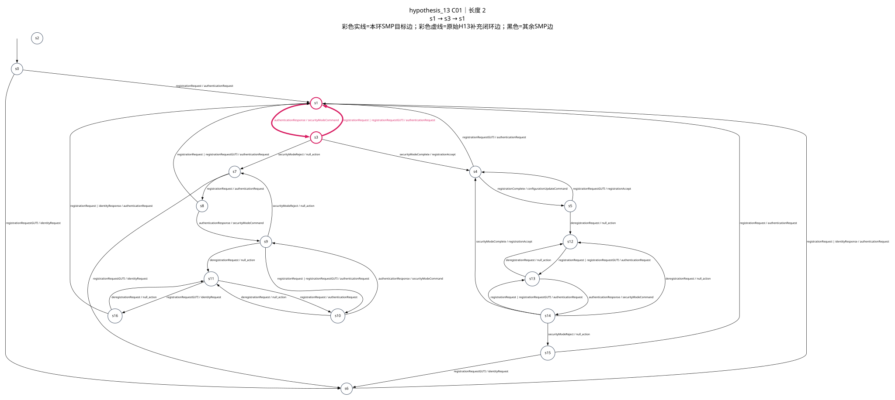
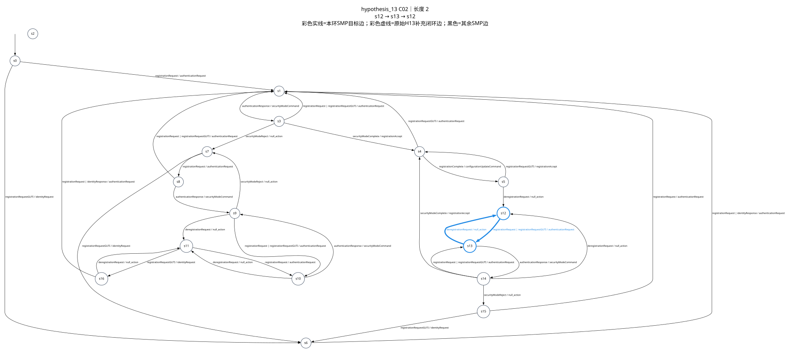
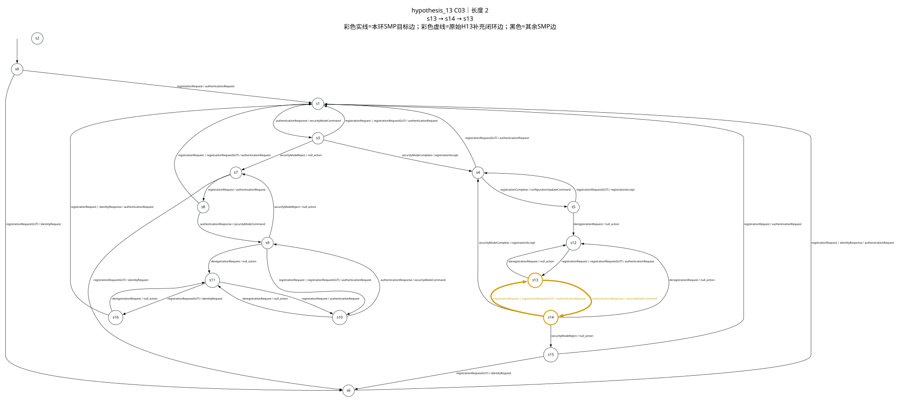
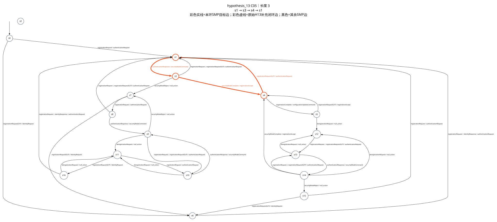
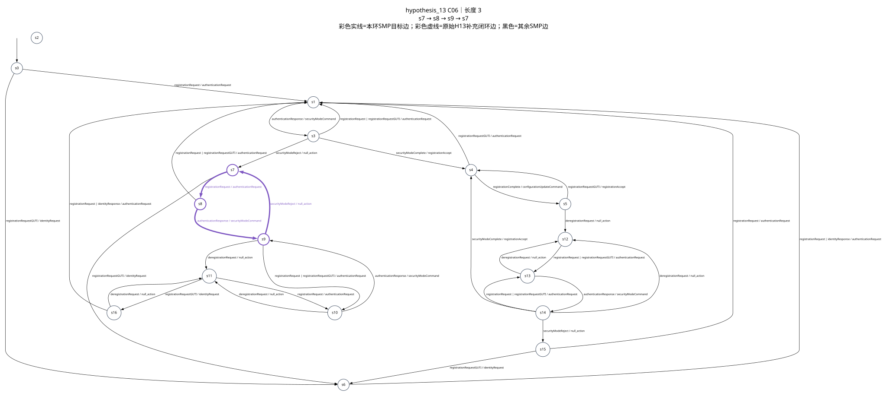
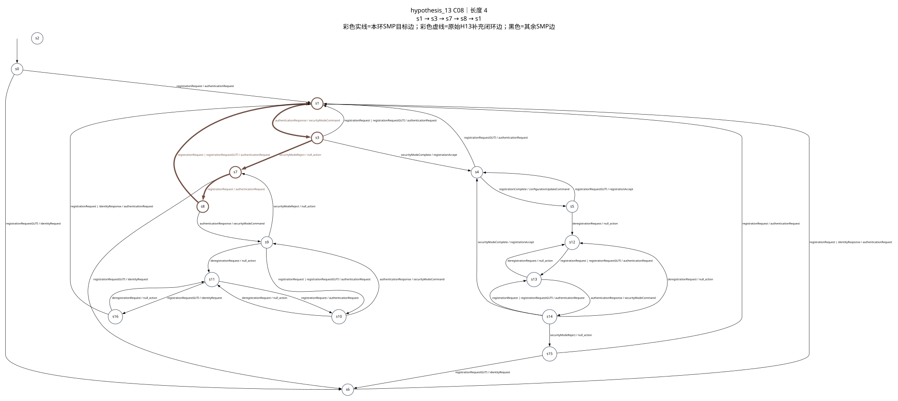
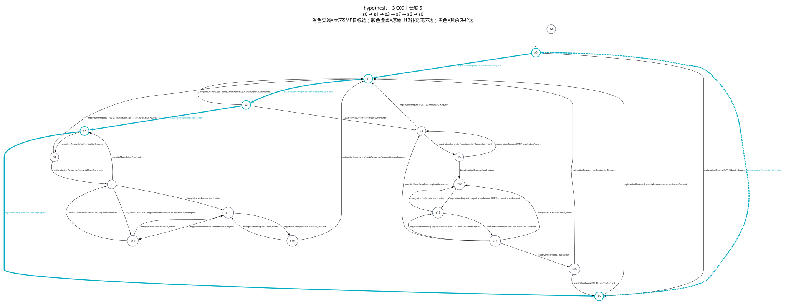
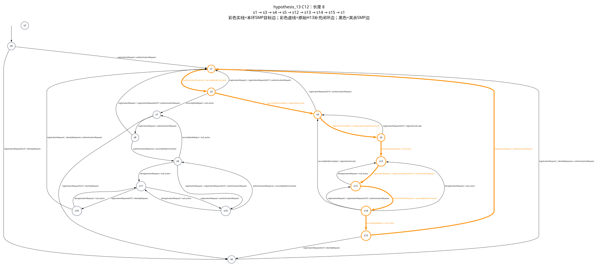
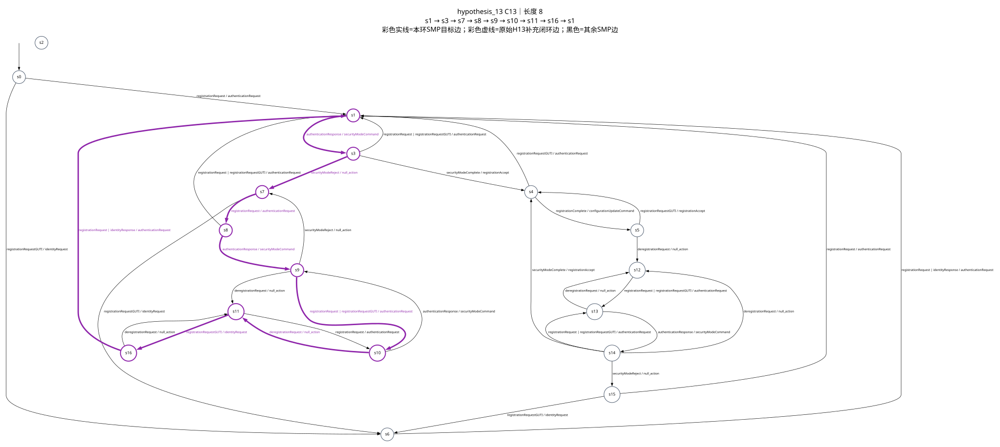

# hypothesis_13 最小环覆盖报告

## 1. 输入与约束

- SMP 覆盖目标：`D:\state-learning-lab\projects\state-learning-experiments\experiments\open5gs\ueransim-smc-context-pdu-selection\open5gs266-smc-context-h13-interrupted-20260730\analysis\derived\hypothesis_13_smp.dot`
- SMP SHA-256：`4fe68f3e8836d86c3b77c2c8c4671ff4b437690eeaf2870084764ab66027797f`
- 闭环来源：`D:\state-learning-lab\projects\state-learning-experiments\experiments\open5gs\ueransim-smc-context-pdu-selection\open5gs266-smc-context-h13-interrupted-20260730\evidence\hypotheses\hypothesis_13.dot`
- 闭环来源 SHA-256：`465fc8f4e5cba3715ec8745cbc81f9d24f5876fdb37d455f858f02f01815523a`
- 排除状态：`s2`
- 必需输入信令：
- 必需输出信令：`authenticationRequest`, `securityModeCommand`
- 信令约束模式：`output-only`
- 闭合游走 fallback：启用并已使用
- 覆盖口径：每条 SMP 目标边至少属于一个选中环；原始 DOT 的额外边只用于闭环。

## 2. 从小到大的候选环统计

| 环长度 | 候选环数 | 最优解选中数 |
|---:|---:|---:|
| 2 | 6 | 3 |
| 3 | 6 | 4 |
| 4 | 6 | 1 |
| 5 | 7 | 2 |
| 6 | 2 | 0 |
| 7 | 6 | 1 |
| 8 | 5 | 2 |
| 9 | 7 | 1 |
| 10 | 9 | 0 |
| 11 | 5 | 0 |
| 12 | 4 | 0 |

## 3. 精确最优结果

- 目标边覆盖：33 / 33
- 最小最大环长度：9
- 环数量：14
- 总环长：64
- 不同转移数：35
- 重复转移使用次数：29

词典序目标：最大环长度 → 环数量 → 重复转移使用次数 → 总环长 → 规范候选 ID。

## 4. 选中的环

每张图都保留完整 SMP；彩色边和节点属于当前环，黑色边是其余 SMP 转移，彩色虚线是从原始 H13 补入的闭环转移。

| 环 | 颜色 | 长度 | 路径 | 覆盖目标边 | SMP 图 |
|---|---|---:|---|---:|---|
| C01 | `#D81B60` | 2 | `s1 → s3 → s1` | 2 | [SVG](cycles/hypothesis_13_smp_cycle_01_len02.svg) |
| C02 | `#1E88E5` | 2 | `s12 → s13 → s12` | 2 | [SVG](cycles/hypothesis_13_smp_cycle_02_len02.svg) |
| C03 | `#D19A00` | 2 | `s13 → s14 → s13` | 2 | [SVG](cycles/hypothesis_13_smp_cycle_03_len02.svg) |
| C04 | `#004D40` | 3 | `s0 → s6 → s1 → s0` | 2 | [SVG](cycles/hypothesis_13_smp_cycle_04_len03.svg) |
| C05 | `#F4511E` | 3 | `s1 → s3 → s4 → s1` | 3 | [SVG](cycles/hypothesis_13_smp_cycle_05_len03.svg) |
| C06 | `#7E57C2` | 3 | `s7 → s8 → s9 → s7` | 3 | [SVG](cycles/hypothesis_13_smp_cycle_06_len03.svg) |
| C07 | `#43A047` | 3 | `s12 → s13 → s14 → s12` | 3 | [SVG](cycles/hypothesis_13_smp_cycle_07_len03.svg) |
| C08 | `#6D4C41` | 4 | `s1 → s3 → s7 → s8 → s1` | 4 | [SVG](cycles/hypothesis_13_smp_cycle_08_len04.svg) |
| C09 | `#00ACC1` | 5 | `s0 → s1 → s3 → s7 → s6 → s0` | 4 | [SVG](cycles/hypothesis_13_smp_cycle_09_len05.svg) |
| C10 | `#7A8B00` | 5 | `s11 → s16 → s11 → s10 → s9 → s11` | 5 | [SVG](cycles/hypothesis_13_smp_cycle_10_len05.svg) |
| C11 | `#3949AB` | 7 | `s4 → s5 → s4 → s5 → s12 → s13 → s14 → s4` | 6 | [SVG](cycles/hypothesis_13_smp_cycle_11_len07.svg) |
| C12 | `#FB8C00` | 8 | `s1 → s3 → s4 → s5 → s12 → s13 → s14 → s15 → s1` | 8 | [SVG](cycles/hypothesis_13_smp_cycle_12_len08.svg) |
| C13 | `#8E24AA` | 8 | `s1 → s3 → s7 → s8 → s9 → s10 → s11 → s16 → s1` | 8 | [SVG](cycles/hypothesis_13_smp_cycle_13_len08.svg) |
| C14 | `#00897B` | 9 | `s1 → s3 → s4 → s5 → s12 → s13 → s14 → s15 → s6 → s1` | 9 | [SVG](cycles/hypothesis_13_smp_cycle_14_len09.svg) |

### C01（长度 2，颜色 `#D81B60`）

- 路径：`s1 → s3 → s1`
- 覆盖目标边：E003, E004
- 转移：
  - `s1 → s3`：`authenticationResponse / securityModeCommand`（target, 必需信令, 全局复用×7）
  - `s3 → s1`：`registrationRequest | registrationRequestGUTI / authenticationRequest`（target, 必需信令）

### C02（长度 2，颜色 `#1E88E5`）

- 路径：`s12 → s13 → s12`
- 覆盖目标边：E023, E024
- 转移：
  - `s12 → s13`：`registrationRequest | registrationRequestGUTI / authenticationRequest`（target, 必需信令, 全局复用×5）
  - `s13 → s12`：`deregistrationRequest / null_action`（target）

### C03（长度 2，颜色 `#D19A00`）

- 路径：`s13 → s14 → s13`
- 覆盖目标边：E025, E026
- 转移：
  - `s13 → s14`：`authenticationResponse / securityModeCommand`（target, 必需信令, 全局复用×5）
  - `s14 → s13`：`registrationRequest | registrationRequestGUTI / authenticationRequest`（target, 必需信令）

### C04（长度 3，颜色 `#004D40`）

- 路径：`s0 → s6 → s1 → s0`
- 覆盖目标边：E002, E011
- 转移：
  - `s0 → s6`：`registrationRequestGUTI / identityRequest`（target）
  - `s6 → s1`：`registrationRequest | identityResponse / authenticationRequest`（target, 必需信令, 全局复用×2）
  - `s1 → s0`：`deregistrationRequest / null_action`（closure）

### C05（长度 3，颜色 `#F4511E`）

- 路径：`s1 → s3 → s4 → s1`
- 覆盖目标边：E003, E006, E007
- 转移：
  - `s1 → s3`：`authenticationResponse / securityModeCommand`（target, 必需信令, 全局复用×7）
  - `s3 → s4`：`securityModeComplete / registrationAccept`（target, 全局复用×3）
  - `s4 → s1`：`registrationRequestGUTI / authenticationRequest`（target, 必需信令）

### C06（长度 3，颜色 `#7E57C2`）

- 路径：`s7 → s8 → s9 → s7`
- 覆盖目标边：E012, E015, E018
- 转移：
  - `s7 → s8`：`registrationRequest / authenticationRequest`（target, 必需信令, 全局复用×3）
  - `s8 → s9`：`authenticationResponse / securityModeCommand`（target, 必需信令, 全局复用×2）
  - `s9 → s7`：`securityModeReject / null_action`（target）

### C07（长度 3，颜色 `#43A047`）

- 路径：`s12 → s13 → s14 → s12`
- 覆盖目标边：E023, E025, E027
- 转移：
  - `s12 → s13`：`registrationRequest | registrationRequestGUTI / authenticationRequest`（target, 必需信令, 全局复用×5）
  - `s13 → s14`：`authenticationResponse / securityModeCommand`（target, 必需信令, 全局复用×5）
  - `s14 → s12`：`deregistrationRequest / null_action`（target）

### C08（长度 4，颜色 `#6D4C41`）

- 路径：`s1 → s3 → s7 → s8 → s1`
- 覆盖目标边：E003, E005, E012, E014
- 转移：
  - `s1 → s3`：`authenticationResponse / securityModeCommand`（target, 必需信令, 全局复用×7）
  - `s3 → s7`：`securityModeReject / null_action`（target, 全局复用×3）
  - `s7 → s8`：`registrationRequest / authenticationRequest`（target, 必需信令, 全局复用×3）
  - `s8 → s1`：`registrationRequest | registrationRequestGUTI / authenticationRequest`（target, 必需信令）

### C09（长度 5，颜色 `#00ACC1`）

- 路径：`s0 → s1 → s3 → s7 → s6 → s0`
- 覆盖目标边：E001, E003, E005, E013
- 转移：
  - `s0 → s1`：`registrationRequest / authenticationRequest`（target, 必需信令）
  - `s1 → s3`：`authenticationResponse / securityModeCommand`（target, 必需信令, 全局复用×7）
  - `s3 → s7`：`securityModeReject / null_action`（target, 全局复用×3）
  - `s7 → s6`：`registrationRequestGUTI / identityRequest`（target）
  - `s6 → s0`：`deregistrationRequest / null_action`（closure）

### C10（长度 5，颜色 `#7A8B00`）

- 路径：`s11 → s16 → s11 → s10 → s9 → s11`
- 覆盖目标边：E017, E020, E021, E022, E033
- 转移：
  - `s11 → s16`：`registrationRequestGUTI / identityRequest`（target, 全局复用×2）
  - `s16 → s11`：`deregistrationRequest / null_action`（target）
  - `s11 → s10`：`registrationRequest / authenticationRequest`（target, 必需信令）
  - `s10 → s9`：`authenticationResponse / securityModeCommand`（target, 必需信令）
  - `s9 → s11`：`deregistrationRequest / null_action`（target）

### C11（长度 7，颜色 `#3949AB`）

- 路径：`s4 → s5 → s4 → s5 → s12 → s13 → s14 → s4`
- 覆盖目标边：E008, E009, E010, E023, E025, E029
- 转移：
  - `s4 → s5`：`registrationComplete / configurationUpdateCommand`（target, 全局复用×4）
  - `s5 → s4`：`registrationRequestGUTI / registrationAccept`（target）
  - `s4 → s5`：`registrationComplete / configurationUpdateCommand`（target, 全局复用×4）
  - `s5 → s12`：`deregistrationRequest / null_action`（target, 全局复用×3）
  - `s12 → s13`：`registrationRequest | registrationRequestGUTI / authenticationRequest`（target, 必需信令, 全局复用×5）
  - `s13 → s14`：`authenticationResponse / securityModeCommand`（target, 必需信令, 全局复用×5）
  - `s14 → s4`：`securityModeComplete / registrationAccept`（target）

### C12（长度 8，颜色 `#FB8C00`）

- 路径：`s1 → s3 → s4 → s5 → s12 → s13 → s14 → s15 → s1`
- 覆盖目标边：E003, E006, E008, E010, E023, E025, E028, E030
- 转移：
  - `s1 → s3`：`authenticationResponse / securityModeCommand`（target, 必需信令, 全局复用×7）
  - `s3 → s4`：`securityModeComplete / registrationAccept`（target, 全局复用×3）
  - `s4 → s5`：`registrationComplete / configurationUpdateCommand`（target, 全局复用×4）
  - `s5 → s12`：`deregistrationRequest / null_action`（target, 全局复用×3）
  - `s12 → s13`：`registrationRequest | registrationRequestGUTI / authenticationRequest`（target, 必需信令, 全局复用×5）
  - `s13 → s14`：`authenticationResponse / securityModeCommand`（target, 必需信令, 全局复用×5）
  - `s14 → s15`：`securityModeReject / null_action`（target, 全局复用×2）
  - `s15 → s1`：`registrationRequest / authenticationRequest`（target, 必需信令）

### C13（长度 8，颜色 `#8E24AA`）

- 路径：`s1 → s3 → s7 → s8 → s9 → s10 → s11 → s16 → s1`
- 覆盖目标边：E003, E005, E012, E015, E016, E019, E022, E032
- 转移：
  - `s1 → s3`：`authenticationResponse / securityModeCommand`（target, 必需信令, 全局复用×7）
  - `s3 → s7`：`securityModeReject / null_action`（target, 全局复用×3）
  - `s7 → s8`：`registrationRequest / authenticationRequest`（target, 必需信令, 全局复用×3）
  - `s8 → s9`：`authenticationResponse / securityModeCommand`（target, 必需信令, 全局复用×2）
  - `s9 → s10`：`registrationRequest | registrationRequestGUTI / authenticationRequest`（target, 必需信令）
  - `s10 → s11`：`deregistrationRequest / null_action`（target）
  - `s11 → s16`：`registrationRequestGUTI / identityRequest`（target, 全局复用×2）
  - `s16 → s1`：`registrationRequest | identityResponse / authenticationRequest`（target, 必需信令）

### C14（长度 9，颜色 `#00897B`）

- 路径：`s1 → s3 → s4 → s5 → s12 → s13 → s14 → s15 → s6 → s1`
- 覆盖目标边：E003, E006, E008, E010, E011, E023, E025, E028, E031
- 转移：
  - `s1 → s3`：`authenticationResponse / securityModeCommand`（target, 必需信令, 全局复用×7）
  - `s3 → s4`：`securityModeComplete / registrationAccept`（target, 全局复用×3）
  - `s4 → s5`：`registrationComplete / configurationUpdateCommand`（target, 全局复用×4）
  - `s5 → s12`：`deregistrationRequest / null_action`（target, 全局复用×3）
  - `s12 → s13`：`registrationRequest | registrationRequestGUTI / authenticationRequest`（target, 必需信令, 全局复用×5）
  - `s13 → s14`：`authenticationResponse / securityModeCommand`（target, 必需信令, 全局复用×5）
  - `s14 → s15`：`securityModeReject / null_action`（target, 全局复用×2）
  - `s15 → s6`：`registrationRequestGUTI / identityRequest`（target）
  - `s6 → s1`：`registrationRequest | identityResponse / authenticationRequest`（target, 必需信令, 全局复用×2）

## 5. 环循环输入序列

- 文件：`D:\state-learning-lab\projects\state-learning-experiments\experiments\open5gs\ueransim-smc-context-pdu-selection\open5gs266-smc-context-h13-interrupted-20260730\inputs\hypothesis_13_cycle_cover_repeat10.seq`
- SHA-256：`31a645f38976e61953c20c3ba99dc5af137e93926a2a6844d41f500b4f753f20`
- 访问起点：`s0`
- 每条具体环重复次数：10
- 合并输入策略：`expand`
- 总行数：28

| 环 | 循环起点 | 最短前缀 | 组合数 | 行号 | 每行输入数 |
|---|---|---|---:|---:|---:|
| C01 | `s1` | `registrationRequest` | 2 | 1–2 | 21 |
| C02 | `s12` | `registrationRequest authenticationResponse securityModeComplete registrationComplete deregistrationRequest` | 2 | 3–4 | 25 |
| C03 | `s13` | `registrationRequest authenticationResponse securityModeComplete registrationComplete deregistrationRequest registrationRequest` | 2 | 5–6 | 26 |
| C04 | `s0` | `（空序列）` | 2 | 7–8 | 30 |
| C05 | `s1` | `registrationRequest` | 1 | 9–9 | 31 |
| C06 | `s7` | `registrationRequest authenticationResponse securityModeReject` | 1 | 10–10 | 33 |
| C07 | `s12` | `registrationRequest authenticationResponse securityModeComplete registrationComplete deregistrationRequest` | 2 | 11–12 | 35 |
| C08 | `s1` | `registrationRequest` | 2 | 13–14 | 41 |
| C09 | `s0` | `（空序列）` | 1 | 15–15 | 50 |
| C10 | `s9` | `registrationRequest authenticationResponse securityModeReject registrationRequest authenticationResponse` | 1 | 16–16 | 55 |
| C11 | `s4` | `registrationRequest authenticationResponse securityModeComplete` | 2 | 17–18 | 73 |
| C12 | `s1` | `registrationRequest` | 2 | 19–20 | 81 |
| C13 | `s1` | `registrationRequest` | 4 | 21–24 | 81 |
| C14 | `s1` | `registrationRequest` | 4 | 25–28 | 91 |

## 6. 目标边覆盖

| 目标边 | 转移 | 覆盖次数 | 环 |
|---|---|---:|---|
| E001 | `s0 → s1` `registrationRequest / authenticationRequest` | 1 | C09 |
| E002 | `s0 → s6` `registrationRequestGUTI / identityRequest` | 1 | C04 |
| E003 | `s1 → s3` `authenticationResponse / securityModeCommand` | 7 | C01, C05, C08, C09, C12, C13, C14 |
| E004 | `s3 → s1` `registrationRequest | registrationRequestGUTI / authenticationRequest` | 1 | C01 |
| E005 | `s3 → s7` `securityModeReject / null_action` | 3 | C08, C09, C13 |
| E006 | `s3 → s4` `securityModeComplete / registrationAccept` | 3 | C05, C12, C14 |
| E007 | `s4 → s1` `registrationRequestGUTI / authenticationRequest` | 1 | C05 |
| E008 | `s4 → s5` `registrationComplete / configurationUpdateCommand` | 3 | C11, C12, C14 |
| E009 | `s5 → s4` `registrationRequestGUTI / registrationAccept` | 1 | C11 |
| E010 | `s5 → s12` `deregistrationRequest / null_action` | 3 | C11, C12, C14 |
| E011 | `s6 → s1` `registrationRequest | identityResponse / authenticationRequest` | 2 | C04, C14 |
| E012 | `s7 → s8` `registrationRequest / authenticationRequest` | 3 | C06, C08, C13 |
| E013 | `s7 → s6` `registrationRequestGUTI / identityRequest` | 1 | C09 |
| E014 | `s8 → s1` `registrationRequest | registrationRequestGUTI / authenticationRequest` | 1 | C08 |
| E015 | `s8 → s9` `authenticationResponse / securityModeCommand` | 2 | C06, C13 |
| E016 | `s9 → s10` `registrationRequest | registrationRequestGUTI / authenticationRequest` | 1 | C13 |
| E017 | `s9 → s11` `deregistrationRequest / null_action` | 1 | C10 |
| E018 | `s9 → s7` `securityModeReject / null_action` | 1 | C06 |
| E019 | `s10 → s11` `deregistrationRequest / null_action` | 1 | C13 |
| E020 | `s10 → s9` `authenticationResponse / securityModeCommand` | 1 | C10 |
| E021 | `s11 → s10` `registrationRequest / authenticationRequest` | 1 | C10 |
| E022 | `s11 → s16` `registrationRequestGUTI / identityRequest` | 2 | C10, C13 |
| E023 | `s12 → s13` `registrationRequest | registrationRequestGUTI / authenticationRequest` | 5 | C02, C07, C11, C12, C14 |
| E024 | `s13 → s12` `deregistrationRequest / null_action` | 1 | C02 |
| E025 | `s13 → s14` `authenticationResponse / securityModeCommand` | 5 | C03, C07, C11, C12, C14 |
| E026 | `s14 → s13` `registrationRequest | registrationRequestGUTI / authenticationRequest` | 1 | C03 |
| E027 | `s14 → s12` `deregistrationRequest / null_action` | 1 | C07 |
| E028 | `s14 → s15` `securityModeReject / null_action` | 2 | C12, C14 |
| E029 | `s14 → s4` `securityModeComplete / registrationAccept` | 1 | C11 |
| E030 | `s15 → s1` `registrationRequest / authenticationRequest` | 1 | C12 |
| E031 | `s15 → s6` `registrationRequestGUTI / identityRequest` | 1 | C14 |
| E032 | `s16 → s1` `registrationRequest | identityResponse / authenticationRequest` | 1 | C13 |
| E033 | `s16 → s11` `deregistrationRequest / null_action` | 1 | C10 |

## 7. 重复转移

| 转移 | 类型 | 使用次数 | 重复次数 |
|---|---|---:|---:|
| `s1 → s3` `authenticationResponse / securityModeCommand` | target | 7 | 6 |
| `s3 → s4` `securityModeComplete / registrationAccept` | target | 3 | 2 |
| `s3 → s7` `securityModeReject / null_action` | target | 3 | 2 |
| `s4 → s5` `registrationComplete / configurationUpdateCommand` | target | 4 | 3 |
| `s5 → s12` `deregistrationRequest / null_action` | target | 3 | 2 |
| `s6 → s1` `registrationRequest | identityResponse / authenticationRequest` | target | 2 | 1 |
| `s7 → s8` `registrationRequest / authenticationRequest` | target | 3 | 2 |
| `s8 → s9` `authenticationResponse / securityModeCommand` | target | 2 | 1 |
| `s11 → s16` `registrationRequestGUTI / identityRequest` | target | 2 | 1 |
| `s12 → s13` `registrationRequest | registrationRequestGUTI / authenticationRequest` | target | 5 | 4 |
| `s13 → s14` `authenticationResponse / securityModeCommand` | target | 5 | 4 |
| `s14 → s15` `securityModeReject / null_action` | target | 2 | 1 |
